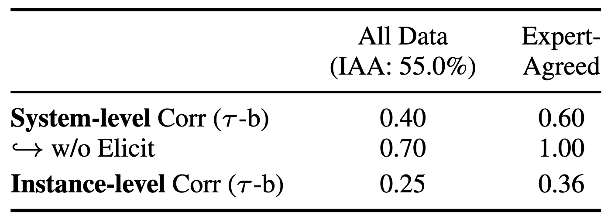
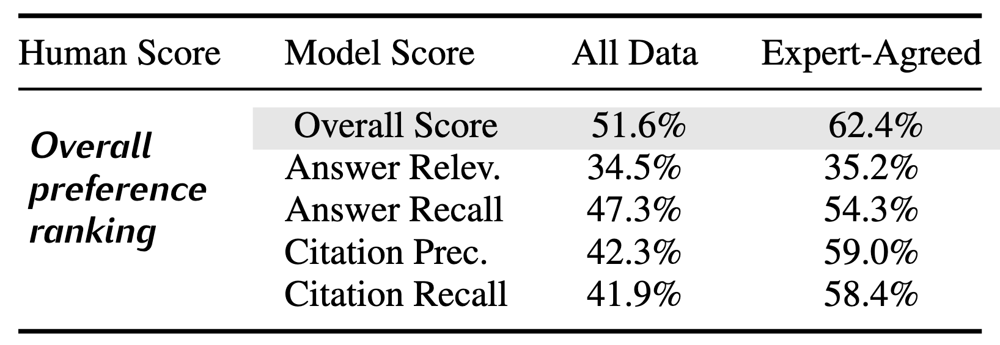
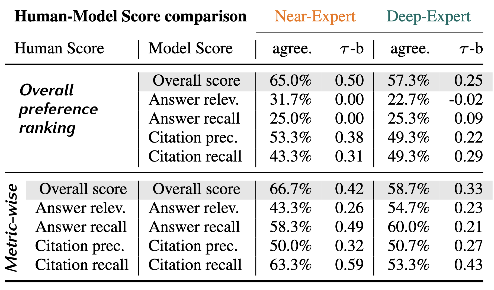

# Meta-Evaluation: Human-Model Agreement Analysis

This directory contains the code for agreement calculation between human and automated model evaluations in pairwise comparisons of ScholarQA-CS2 eval system outputs.

## Directory Structure

```
agreement_calculation/
├── calculate_agreement.py          # Main analysis script
└── annotation/
    ├── pairwise_authored.json      # Deep-Expert evaluation set
    ├── pairwise_chosen.json        # Near-Expert evaluation set
    ├── pairwise_dev_assigned_ann1.json   # Dev set annotator 1
    ├── pairwise_dev_assigned_ann2.json   # Dev set annotator 2
    ├── pairwise_test_assigned_ann1.json  # Test set annotator 1
    ├── pairwise_test_assigned_ann2.json  # Test set annotator 2
    ├── pairwise_dev_assigned_agreement_only.json   # Dev set (agreed only)
    └── pairwise_test_assigned_agreement_only.json  # Test set (agreed only)
```

## Requirements

- Python 3.x
- Required packages:
  - numpy
  - pandas
  - scipy

## Data Format

Each annotation entry contains pairwise comparison data:
```json
{
  "question": "The research question text",
  "models": ["model_a", "model_b"],
  "question_intent": "Category of question",
  "human_overall": [0.85, 0.875],
  "model_overall": [0.567, 0.564],
  "human_answer_precision": [...],
  "model_answer_precision": [...],
  ...
}
```

## Usage

Run the agreement analysis script:

```bash
python calculate_agreement.py [OPTIONS]
```

Configuration options:
- `--tie_strategy`: How to handle ties (`threshold`, `exclude`, or `partial`, default: `threshold`)
- `--dont_use_thresholds`: Disable threshold-based tie detection
- `--subselect_models`: Comma-delimited list of models to analyze (optional)
- `--human_agreed`: Only use instances where human annotators agreed
- `--drop_elicit`: Exclude 'elicit' model from system ranking
- `--source`: Filter by data source (`deep_expert`, `near_expert`, or `assigned`, default: `assigned`)

The script generates three types of analysis:

1. **Inter-Annotator Agreement (IAA)**: When using doubly-annotated data
   - Strict agreement rate
   - Half-credit agreement rate (gives credit for one annotator calling a tie)

2. **Agreement Metrics (Pairwise Overall & Metric-wise) Table**: For each human-model metric pair
   - Agreement rate
   - Kendall's tau correlation
   - Total number of comparisons
   - Optimal threshold used

3. **System Rankings**: Model performance rankings based on:
   - Human preference rankings
   - Kendall's tau correlation between rankings


## Replicating agreement results from the paper


### Agreement Correlation & Agreement with Overall Preference. 

(Please note that the tables reflect the numbering in the paper.)

### Tables 2 & 3
<figure>
    
    <figcaption>Table 2: System and instance-level correlations (Kendall Tau-b).</figcaption>
</figure>

<figure>
    
    <figcaption>Table 3: Pairwise agreements between expert overall preference ranking vs. model scores.</figcaption>
</figure>

<br>

**Overall Preference; Random assignment. All Data.**
```
python calculate_agreement.py
```
* See "Pairwise Agreements" in the output for Table 3 "All Data" results
* See "System Rankings" in the output for system level correlation result (Table 2, All Data). 
* See corr with overall score under "Pairwise Agreements" in the output for instance-level correlation result (Table 2, All Data).
* Use `--drop_elicit` for "w/o Elicit" result.

**Overall Preference; Random assignment. Expert-Agreed only.**
```
python calculate_agreement.py --human_agreed
```
* See "Pairwise Agreements"  in the output for Table 3 "Expert-Agreed" results
* See "System Rankings"  in the output for system level correlation result (Table 2, Expert-Agreed). 
* See corr with overall score under "Pairwise Agreements"  in the output for instance-level correlation result (Table 2, Expert-Agreed).
* Use `--drop_elicit` for "w/o Elicit" result.

### Table 4
<figure>
    
    <figcaption style="width:90%">Table 4: Results from metric-wise evaluation with expertise control. We compare instance-level agreement between model scores and two human signals: human preference (TOP) and  metric-wise human ratings (BOTTOM).</figcaption>
</figure>

<br>

**Near-Expert & Deep-Expert**
```
python calculate_agreement.py --source {near_expert|deep_expert}
```
* See "Pairwise Agreements" for overall preference comparison (TOP)
* See "Metric-Wise" for metric-wise comparison (BOTTOM)

